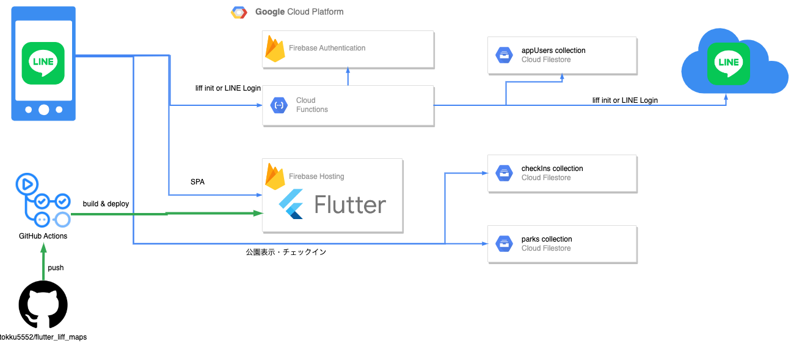

# Flutter LIFF MAPS

このリポジトリは、2023年7月28日に開催される Flutter 大学と LINE DC のコラボ企画、「Flutter×Firebase×LINE で位置情報サービスハンズオン！【Flutter 大学コラボ】」のためのものです。

[connpass](https://linedevelopercommunity.connpass.com/event/283738/)

[Flutter 大学](https://flutteruniv.com/)

[LINE Developers Community](https://linedevelopercommunity.connpass.com/)

具体的な実装に関しては、``Firebase Hosting`` に加えて ``LINE ログイン`` と ``Firebase Authentication``、``Cloud Functions`` を組み合わせてシームレスに認証を実行したり、``Google Map API`` と [geoflutterfire_plus](https://pub.dev/packages/geoflutterfire_plus) を組み合わせて LIFF 上で地図を表示するなど、より実践的なものとなっています。実装の詳細に関しては、[こちら](https://zenn.dev/tokku5552/books/flutter-web-liff-maps)をご覧ください。

## アプリイメージ

TODO

## アプリの機能

- 自分の近くにある公園を探すことができる。
- チェックインすることができる。
- 公園ごとにチェックインした人が見える。
- 友人がチェックインしたら通知が来る。

## アーキテクチャ図



## 環境

```bash
fvm flutter --version
Flutter 3.10.2 • channel stable • https://github.com/flutter/flutter.git
Framework • revision 9cd3d0d9ff (6 days ago) • 2023-05-23 20:57:28 -0700
Engine • revision 90fa3ae28f
Tools • Dart 3.0.2 • DevTools 2.23.1
```

## ローカル環境での実行および開発の進め方

[FVM](https://fvm.app/docs/getting_started/in) を導入する。

```bash
brew tap leoafarias/fvm
brew install fvm
```

`.fvm/fvm_config.json` に Flutter SDK のバージョンが指定されているので、下記のコマンドを実行する。

```bash
fvm install
```

VS Code を使っている場合は、`.vscode/settings.json` の設定により、FVM の Flutter に同梱されている Dart SDK が使用されるようになっている。VS Code 以外を使用している場合は所望の通りに対応する。

ローカルホストの 8080 番ポートでデバッグ実行する。

```bash
fvm flutter run -d  web-server --web-port 8080 --dart-define-from-file=dart_define.json
```

ngrok をインストールする。

```bash
brew install ngrok
```

<https://dashboard.ngrok.com/> にアクセスしサインアップした後に、認証を行う。

```bash
ngrok config add-authtoken <your-auth-token>
```

ngrok でローカルホストの 8080 番ポートを一時公開（`fvm flutter run` しているターミナルとは別ターミナルで実行）する。

```bash
ngrok http 8080
```

ngrok を起動したターミナルで表示されている `Forwarding` の `https://<ランダム値>.ngrok.io` の URL を LINE Developers コンソールから、

- LINE Login の Callback URL（Use LINE Login in your web app を有効にする）
- LIFF の Endpoint URL

に指定する。

上記の設定を済ませた上で、LINE アプリの適当なトーク画面に `https://liff.line.me/{YOUR-LIFF-ID}` の LIFF URL を貼り、タップすると、トーク画面上で LIFF アプリを起動することができる。

ローカルで Flutter アプリのソースコードを編集したら、`fvm flutter run -d web-server --web-port 8080` をしたターミナルで `R` キーを押下してホットリロードすると、再起動した LIFF アプリもその編集内容が反映されるようになるので、そのようにしてデバッグすると良い。

### 環境変数や API キーなどの設定

現在のところでは、Flutter および Firebase Functions の開発・ビルドを行う上で下記の設定が必要となっている。

- `dart-define.json.template` をコピーして `dart-define.json` を作成し、`YOUR-LIFF-ID-HERE` の部分を実際の LIFF ID に差し替える。
- `web/index.sample.html` をコピーして `web/index.html` を作成し、`YOUR-API-KEY-HERE` の部分を実際の Google Maps API Key に差し替える。
- `functions/keys/service_account_key.json` を作成し、Firebase プロジェクトのサービスアカウントキーを反映する。
- `functions/.env.sample` をコピーして `functions/.env` を作成し、`YOUR-LINE-CHANNEL-ID-HERE` の部分を実際の Channel ID に差し替える。
